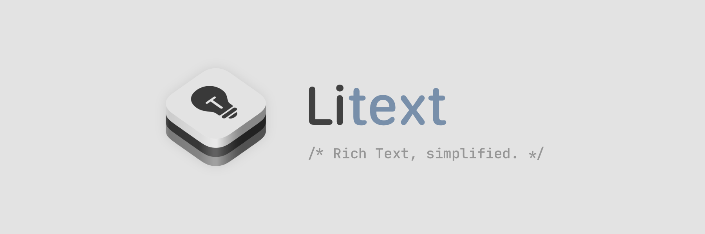
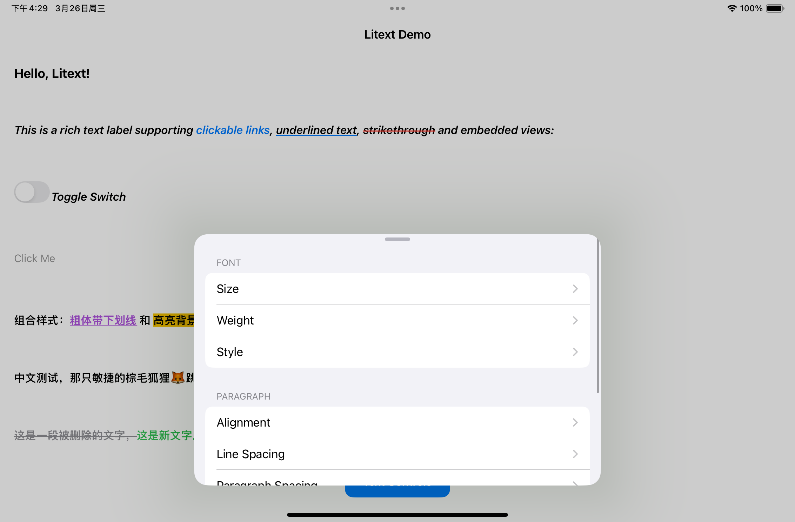

# Litext

A lightweight rich-text library for UIKit and AppKit platforms.

**Note: This fork is reimplemented in Swift. While we've maintained API compatibility with the original, 100% compatibility is not guaranteed.**

## Features

- ⚡️ High performance text layout and rendering
- 📎 Native view embedding via attachments
- 🔗 Clickable links support
- 🎨 Custom drawing callbacks
- 📐 Auto layout integration (experimental)



## Supported Platforms

- iOS 13.0+
- macOS 12.0+

## Installation

Add Litext as a dependency in your `Package.swift` file:

```swift
dependencies: [
    .package(url: "https://github.com/Helixform/Litext.git", branch: "main")
]
```

## Usage

### Basic Setup

```swift
import Litext

let label = LTXLabel()
view.addSubview(label)

// Create and style attributed string
let attributedString = NSMutableAttributedString(
    string: "Hello, Litext!",
    attributes: [
        .font: NSFont.systemFont(ofSize: 16),
        .foregroundColor: NSColor.labelColor
    ]
)

// Set the attributed text
label.attributedText = attributedString
```

### Link Handling

```swift
let linkString = NSAttributedString(
    string: "Visit our website",
    attributes: [
        .font: NSFont.systemFont(ofSize: 14),
        .link: URL(string: "https://example.com")!,
        .foregroundColor: NSColor.linkColor
    ]
)
attributedString.append(linkString)

// Handle link taps
label.tapHandler = { highlightRegion in
    if let url = highlightRegion.attributes[.link] as? URL {
        NSWorkspace.shared.open(url)
    }
}
```

### Embedding Native Views

```swift
// Create and configure attachment
let attachment = LTXAttachment()
let switchView = NSSwitch()
attachment.view = switchView
attachment.size = switchView.intrinsicContentSize

// Add attachment to text
attributedString.append(
    NSAttributedString(
        string: LTXReplacementText,
        attributes: [
            .LTXAttachmentAttributeName: attachment,
            kCTRunDelegateAttributeName as NSAttributedString.Key: attachment.runDelegate
        ]
    )
)
```

## License

This project is licensed under the MIT License - see the [LICENSE](./LICENSE) file for details.
