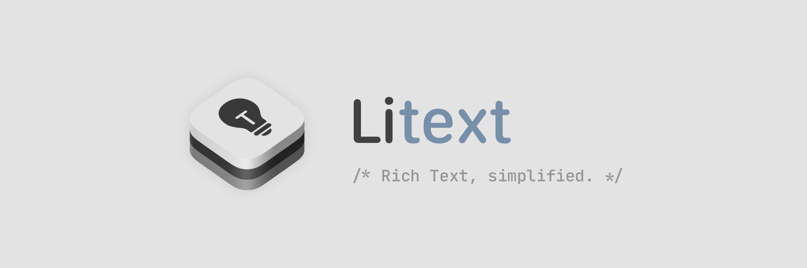
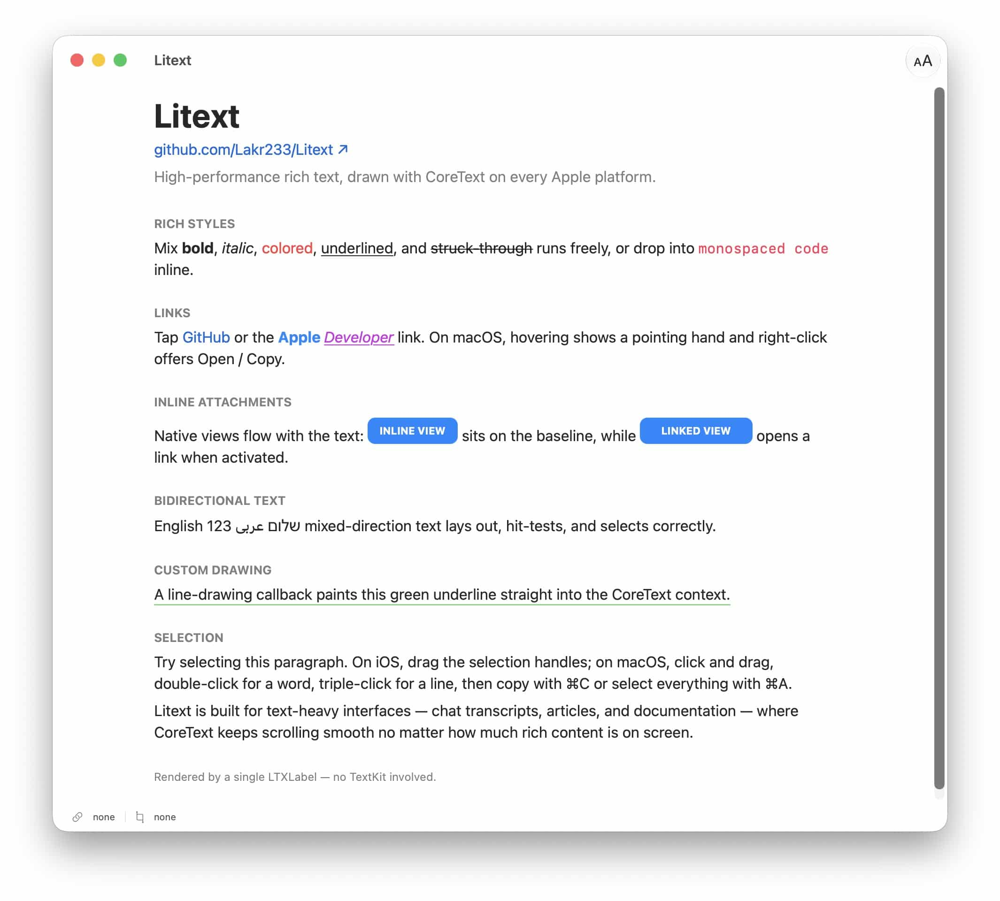
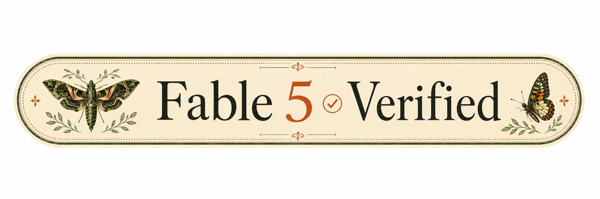

# Litext

A lightweight, high-performance rich-text library for all Apple platforms — UIKit, AppKit, and SwiftUI (including watchOS).

> **Note:** This fork is reimplemented in Swift 6.0 with strict concurrency. Version 2.0 uses renamed public APIs such as `TextLabelView`, `TextLabel`, and `TextLabel.Attachment`.

## Features

- ⚡️ High performance text layout and rendering via CoreText
- 📎 Native view embedding via attachments
- 🔗 Clickable links support
- ✏️ Text selection with copy/paste
- 🎨 Custom per-line drawing callbacks
- 📐 Auto layout integration (experimental)
- 🖥️ SwiftUI support on all platforms, including watchOS



## Supported Platforms

| Platform | Minimum Version | TextLabelView (UIKit/AppKit) | TextLabel (SwiftUI) |
|---|---|---|---|
| iOS | 13.0+ | ✅ | ✅ |
| macOS | 12.0+ | ✅ | ✅ |
| tvOS | 13.0+ | ✅ | ✅ |
| visionOS | 1.0+ | ✅ | ✅ |
| Mac Catalyst | 13.0+ | ✅ | ✅ |
| watchOS | 8.0+ | — | ✅ |

## Installation

Add Litext as a dependency in your `Package.swift` file:

```swift
dependencies: [
    .package(url: "https://github.com/Helixform/Litext.git", branch: "main")
]
```

Or in Xcode: **File → Add Package Dependencies** and enter the repository URL.

## Usage

### UIKit / AppKit

```swift
import Litext

let label = TextLabelView()
view.addSubview(label)

let attributedString = NSMutableAttributedString(
    string: "Hello, Litext!",
    attributes: [
        .font: PlatformFont.systemFont(ofSize: 16),
        .foregroundColor: PlatformColor.label
    ]
)
label.attributedText = attributedString
```

### SwiftUI

`TextLabel` works on all platforms, including watchOS:

```swift
import Litext
import SwiftUI

struct ContentView: View {
    var body: some View {
        TextLabel("Hello, Litext!")
            .selectable()
            .onTapLink { url in
                UIApplication.shared.open(url)
            }
    }
}
```

You can also initialise with an `NSAttributedString` or `AttributedString`:

```swift
TextLabel(attributedString: myNSAttributedString)
TextLabel(attributedString: myAttributedString) // AttributedString (iOS 15+, macOS 12+)
```

### Link Handling

```swift
let mutable = NSMutableAttributedString(string: "Visit GitHub")
mutable.addAttribute(.link, value: URL(string: "https://github.com")!, range: NSRange(location: 6, length: 6))
label.attributedText = mutable

// UIKit/AppKit — implement TextLabelViewDelegate
label.delegate = self

func textLabelView(
    _ textLabelView: TextLabelView,
    didTapHighlightRegion region: TextLabel.HighlightRegion,
    at location: CGPoint
) {
    if let url = region.attributes[.link] as? URL {
        UIApplication.shared.open(url)
    }
}

// SwiftUI — use the modifier
TextLabel(attributedString: mutable)
    .onTapLink { url in
        UIApplication.shared.open(url)
    }
```

### Text Selection

```swift
// Enable selection
label.isSelectable = true
label.selectionBackgroundColor = UIColor.systemBlue.withAlphaComponent(0.2)

// Access selected text
let text = label.selectedPlainText()
let attributed = label.selectedAttributedText()

// Programmatic selection
label.selectionRange = NSRange(location: 0, length: 5)
label.selectAll()
label.clearSelection()

// SwiftUI
TextLabel("Some selectable text")
    .selectable()
```

### Embedding Native Views (Attachments)

Use `TextLabel.Attachment` to embed any view inline in the text:

```swift
// UIKit / AppKit
let attachment = TextLabel.Attachment()
attachment.view = myCustomView          // UIView or NSView
attachment.size = myCustomView.intrinsicContentSize

// watchOS (SwiftUI view instead)
let attachment = TextLabel.Attachment()
attachment.swiftUIView = AnyView(MyCustomView())
attachment.size = CGSize(width: 100, height: 50)

// Insert attachment into attributed string
let attachmentString = attachment.attributedString()
```

### Custom Per-Line Drawing

```swift
let drawingAction = TextLabel.LineDrawingAction { context, line, origin in
    // Custom drawing for each line
    context.setStrokeColor(UIColor.red.cgColor)
    context.move(to: CGPoint(x: origin.x, y: origin.y - 2))
    context.addLine(to: CGPoint(x: origin.x + 100, y: origin.y - 2))
    context.strokePath()
}

attributedString.addAttribute(
    .litextLineDrawingAction,
    value: drawingAction,
    range: fullRange
)
```

## watchOS

On watchOS, `TextLabelView` (the UIView/NSView subclass) is not available. Use `TextLabel` instead — it renders via an off-screen `CGContext` and displays the result as a SwiftUI `Image`.

```swift
import Litext
import SwiftUI

struct WatchContentView: View {
    var body: some View {
        TextLabel(attributedString: styledText)
    }

    var styledText: NSAttributedString {
        let s = NSMutableAttributedString(string: "Hello from Watch!")
        s.addAttribute(.font, value: UIFont.boldSystemFont(ofSize: 14), range: NSRange(location: 0, length: 17))
        return s
    }
}
```

For inline attachments on watchOS, provide a SwiftUI view via `swiftUIView` instead of `view`.

## License

This project is licensed under the MIT License — see the [LICENSE](./LICENSE) file for details.


