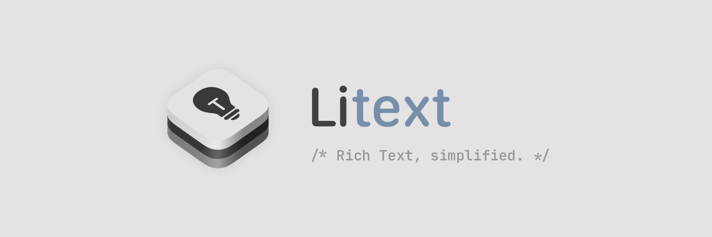
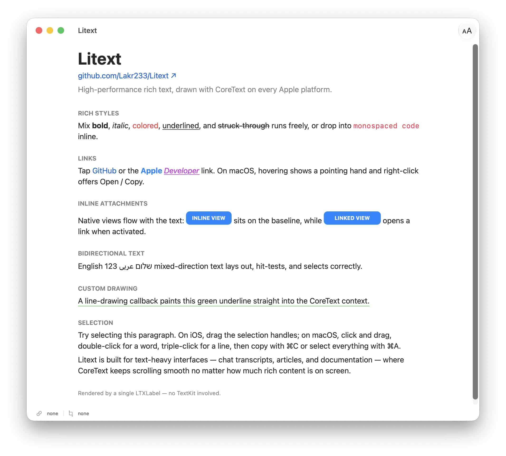
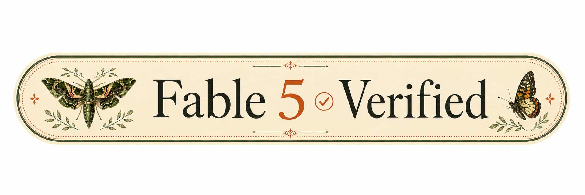

# Litext

A lightweight, high-performance rich-text library for all Apple platforms — UIKit, AppKit, and SwiftUI (including watchOS).

> **Note:** This fork is reimplemented in Swift 6.0 with strict concurrency. Version 2.0 uses renamed public APIs such as `TextLabelView`, `TextLabel`, and `TextLabel.Attachment`.

## Features

- ⚡️ High performance text layout and rendering via CoreText
- 📎 Native view embedding via attachments
- 🔗 Clickable links support
- ✏️ Text selection with copy/paste
- 🔗 One selection across several labels, such as the cells of a table
- 🎨 Custom per-line drawing callbacks
- 🎞️ Animated text changes, such as streamed text fading in, through the optional `LitextAnimation` product
- 📐 Auto layout integration (experimental)
- 🖥️ SwiftUI support on all platforms, including watchOS



## Supported Platforms

Litext supports iOS 15, macOS 12, Mac Catalyst 15, tvOS 15, visionOS 1 and watchOS 8, the oldest systems current toolchains deploy to. It requires Swift 6.2 (Xcode 26) or later.

| Platform | Minimum Version | TextLabelView (UIKit/AppKit) | TextLabel (SwiftUI) |
|---|---|---|---|
| iOS | 15.0+ | ✅ | ✅ |
| macOS | 12.0+ | ✅ | ✅ |
| tvOS | 15.0+ | ✅ | ✅ |
| visionOS | 1.0+ | ✅ | ✅ |
| Mac Catalyst | 15.0+ | ✅ | ✅ |
| watchOS | 8.0+ | — | ✅ |

## Installation

Add Litext as a dependency in your `Package.swift` file:

```swift
dependencies: [
    .package(url: "https://github.com/Helixform/Litext.git", branch: "main")
]
```

Or in Xcode: **File → Add Package Dependencies** and enter the repository URL.

## Usage

### UIKit / AppKit

```swift
import Litext

let label = TextLabelView()
view.addSubview(label)

let attributedString = NSMutableAttributedString(
    string: "Hello, Litext!",
    attributes: [
        .font: PlatformFont.systemFont(ofSize: 16),
        .foregroundColor: PlatformColor.label
    ]
)
label.attributedText = attributedString

// Measure without Auto Layout, as with UILabel: the text wrapped at 300 points.
let size = label.sizeThatFits(CGSize(width: 300, height: 0))
```

### SwiftUI

`TextLabel` works on all platforms, including watchOS:

```swift
import Litext
import SwiftUI

struct ContentView: View {
    var body: some View {
        TextLabel("Hello, Litext!")
            .selectable()
            .onTapLink { url in
                UIApplication.shared.open(url)
            }
    }
}
```

You can also initialise with an `NSAttributedString` or `AttributedString`:

```swift
TextLabel(attributedString: myNSAttributedString)
TextLabel(attributedString: myAttributedString)
```

### Link Handling

```swift
let mutable = NSMutableAttributedString(string: "Visit GitHub")
mutable.addAttribute(.link, value: URL(string: "https://github.com")!, range: NSRange(location: 6, length: 6))
label.attributedText = mutable

// UIKit/AppKit — implement TextLabelViewDelegate
label.delegate = self

func textLabelView(
    _ textLabelView: TextLabelView,
    didTapHighlightRegion region: TextLabel.HighlightRegion,
    at location: CGPoint
) {
    if let url = region.linkURL {
        UIApplication.shared.open(url)
    }
}

// SwiftUI — use the modifier
TextLabel(attributedString: mutable)
    .onTapLink { url in
        UIApplication.shared.open(url)
    }
```

To find what lies under a point yourself, for a long-press preview or a hover card, ask the label. Points are in the label's coordinates:

```swift
if let region = label.highlightRegion(at: point), let url = region.linkURL {
    showPreview(for: url)
}
let index = label.characterIndex(at: point)

// Style the highlight shown while a link is pressed.
label.linkHighlightColor = UIColor.systemBlue.withAlphaComponent(0.2)
label.linkHighlightCornerRadius = 6
```

### Text Selection

```swift
// Enable selection
label.isSelectable = true
label.selectionBackgroundColor = UIColor.systemBlue.withAlphaComponent(0.2)

// Access selected text
let text = label.selectedPlainText()
let attributed = label.selectedAttributedText()

// Programmatic selection
label.selectionRange = NSRange(location: 0, length: 5)
label.selectWord(at: 7)   // as a double-click does
label.selectLine(at: 7)   // as a triple-click does
label.selectAll()
label.clearSelection()

// SwiftUI
TextLabel("Some selectable text")
    .selectable()
```

### Selection Across Labels

Labels that share a `TextSelectionGroup` share one selection, so a selection can run from one label into the next, for example across the cells of a table. Copy, Look Up, Translate and Share act on all of it.

```swift
let group = TextSelectionGroup()
// The order is the reading order: list a table row by row.
group.labels = cells
// Put a tab between cells of a row and a line break between rows.
group.separator = { previous, next in row(of: previous) == row(of: next) ? "\t" : "\n" }
group.delegate = self

// TextSelectionGroupDelegate
func textSelectionGroupDidChangeSelection(_ group: TextSelectionGroup) {
    print(group.selectedPlainText() ?? "")
}

// Add commands to the menu (iOS 16, Mac Catalyst 16 or later).
func textSelectionGroup(
    _ group: TextSelectionGroup,
    editMenuForSuggestedActions suggestedActions: [UIMenuElement],
) -> UIMenu? {
    UIMenu(children: suggestedActions + [copyAsMarkdownAction])
}
```

The group holds its labels weakly; keep the labels alive as usual. `group.selectedSegments` lists the selected range in each label.

### Embedding Native Views (Attachments)

Use `TextLabel.Attachment` to embed any view inline in the text:

```swift
// UIKit / AppKit
let attachment = TextLabel.Attachment()
attachment.view = myCustomView          // UIView or NSView
attachment.size = myCustomView.intrinsicContentSize

// watchOS (SwiftUI view instead)
let attachment = TextLabel.Attachment()
attachment.swiftUIView = AnyView(MyCustomView())
attachment.size = CGSize(width: 100, height: 50)

// Insert attachment into attributed string
let attachmentString = attachment.attributedString()

// Sit it on the baseline instead of a tenth of its height below it.
attachment.descent = 0

// SwiftUI — handle taps on attachments
TextLabel(attributedString: text)
    .onTapAttachment { attachment in
        print("Tapped", attachment)
    }
```

After changing `size` or `descent` of an attachment already on screen, call `reloadTextLayout()` on its label.

### Lines and Geometry

`layoutLines` reports each laid-out line: its character range, its box, and where its baseline starts. Use it to count lines or align with a baseline. `label.textLayout` gives the full `TextLabel.Layout` for anything else, such as `rects(for:)`.

```swift
let lineCount = label.layoutLines.count
if let first = label.layoutLines.first {
    let rect = label.viewRect(fromLayoutRect: first.rect)
    print(first.stringRange, rect)
}
```

Each line also carries its typeset `CTLine` as `line`, so an effect can read glyph runs and positions without typesetting the text again.

Line and run geometry is in CoreText layout space, with the origin at the bottom left; convert it with `viewRect(fromLayoutRect:)`. Each read of `layoutLines` or `layoutRuns(matching:)` builds a new array, so read them once per layout rather than on every frame.

### Custom Per-Line Drawing

```swift
let drawingAction = TextLabel.LineDrawingAction { context, line, origin in
    // Custom drawing for each line
    context.setStrokeColor(UIColor.red.cgColor)
    context.move(to: CGPoint(x: origin.x, y: origin.y - 2))
    context.addLine(to: CGPoint(x: origin.x + 100, y: origin.y - 2))
    context.strokePath()
}

attributedString.addAttribute(
    .litextLineDrawingAction,
    value: drawingAction,
    range: fullRange
)
```

## LitextAnimation

`LitextAnimation` is a separate product that animates text as it changes, for example a model's reply fading in as it streams. Its `LTXAnimatableLabel` is a `TextLabelView` subclass. The library provides only the base layer: a display link that runs while something animates, a diff of each change aligned to grapheme clusters, redrawing of the lines in flight only, and a policy for cell reuse. Effects live in your app, behind the `LTXTextAnimator` protocol.

```swift
dependencies: [
    .product(name: "LitextAnimation", package: "Litext"),
]
```

An animator needs five members. This one fades in each line that new text lands on:

```swift
import LitextAnimation

final class FadeInAnimator: LTXTextAnimator {
    private(set) var animatingRange: NSRange?
    private var start: CFTimeInterval = 0
    private let duration: CFTimeInterval = 0.3

    func animateChange(_ context: LTXAnimationContext, at time: CFTimeInterval) {
        animatingRange = context.change.insertedRange
        start = time
    }

    // Once per frame: name what to redraw, and return false when done.
    func advance(to time: CFTimeInterval, invalidation: LTXInvalidationContext) -> Bool {
        guard let range = animatingRange else { return false }
        invalidation.invalidateCharacters(in: range)
        if time - start >= duration { animatingRange = nil }
        return animatingRange != nil
    }

    // Lines touching `animatingRange` come here, in CoreText space with the text position set.
    func draw(_ line: LTXAnimatedLine, in context: CGContext, at time: CFTimeInterval) -> Bool {
        context.setAlpha(min(max((time - start) / duration, 0), 1))
        CTLineDraw(line.line, context)
        return true // false lets the label draw the line as usual
    }

    func finish() {
        animatingRange = nil
    }
}

let label = LTXAnimatableLabel()
label.animator = FadeInAnimator()
label.attributedText = reply // each later assignment animates only what was added
```

Lines outside `animatingRange` are drawn exactly as `TextLabelView` draws them, and an idle label has no display link and no extra subviews. For effects that draw past the line boxes, or draw glyphs on their way out, implement `overdrawInsets`, `additionalContentBounds` and `drawAdditionalContent(in:at:)`.

**Reuse.** In a reused cell, set `animationIdentity` before the text. A new identity shows its text at once; the same identity keeps animating what arrives:

```swift
cell.label.animationIdentity = message.id
cell.label.attributedText = message.rendered
```

**Policy.** `animationPolicy` decides for each change. The default animates when the label is in a window, animations are enabled (not inside `performWithoutAnimation`), the identity is unchanged, the change is not a whole replacement, and it adds text (or arrives while an animation is still running). Use `LTXClosureAnimationPolicy` for your own rule, `setAttributedText(_:animated: false)` to skip animation once, and `finishAnimations()` to jump to the final state.

**Reduced motion.** Every `LTXAnimationContext` carries `prefersReducedMotion`, so the animator can tone its effect down. When the setting turns on mid-animation, the label finishes the animations in flight.

`LitextAnimation` works on iOS, macOS, Mac Catalyst, tvOS and visionOS. On watchOS the product builds but is empty, since there is no `TextLabelView`. The LitextCatalog sample app shows streaming text, a rolling numeric transition and cell reuse; launch it with `-demo streaming`, `-demo numeric` or `-demo reuse` to open one directly.

## watchOS

On watchOS, `TextLabelView` (the UIView/NSView subclass) is not available. Use `TextLabel` instead — it renders via an off-screen `CGContext` and displays the result as a SwiftUI `Image`.

```swift
import Litext
import SwiftUI

struct WatchContentView: View {
    var body: some View {
        TextLabel(attributedString: styledText)
    }

    var styledText: NSAttributedString {
        let s = NSMutableAttributedString(string: "Hello from Watch!")
        s.addAttribute(.font, value: UIFont.boldSystemFont(ofSize: 14), range: NSRange(location: 0, length: 17))
        return s
    }
}
```

For inline attachments on watchOS, provide a SwiftUI view via `swiftUIView` instead of `view`.

## License

This project is licensed under the MIT License — see the [LICENSE](./LICENSE) file for details.


